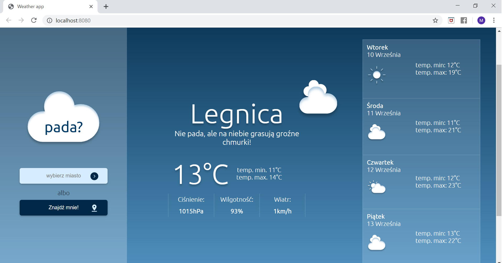
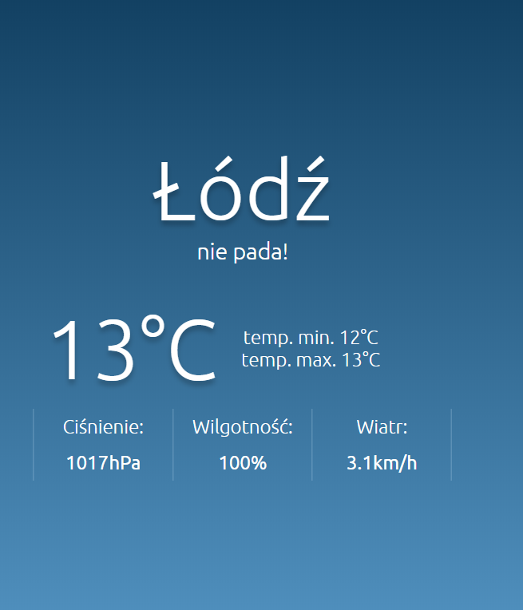
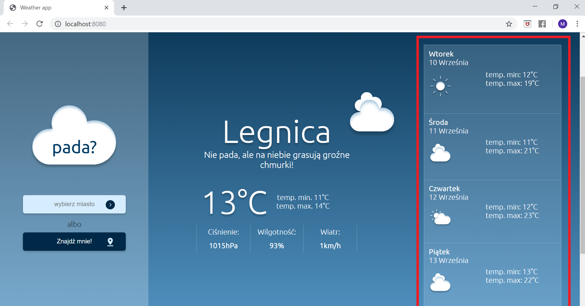
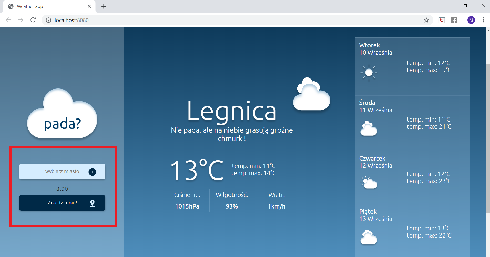

# PADA? - simply weatherApp
It's our weather aplication created for CodersCamp 2019!

## Znajdź to czego szukasz:

1. [Ogólne informacje](#Ogólne-informacje)
2. [Jak to wygląda](#Jak-to-wygląda)
3. [Użyte technologie](#Użyte-technologie)
4. [Struktura plików aplikacji](#Struktura-plików-aplikacji)

## Ogólne informacje.
Pada? jest aplikacją pogodową, któa pozwala uzyskać informację na temat bieżących, a także przyszłych warunków pogodowych wybranej lokalizacji. Informacje wykorzystywane w naszej aplikacji pochodzą z "Hourly forecast by OpenWeatherMap!".

## Jak to wygląda? - wersja demo i grafiki aplikacji.
Oto demo wersja naszej aplikacji : https://malgoskabou.github.io/CoolWeatherApp/

Aplikacja jest intuicyjna i zawiera jeden główny ekran. Jeśli użytkownik poprzednio korzystał z aplikacji, po ponownym uruchomieniu będzie ona wyświetlała pogodę dla ostatniego zapisu. Jeśli użytkownik korzysta po raz pierwszy zostaną wyświetlone dane pogodowe dla dla miejsca, gdzie użytkownik zostanie zlokalizowany(gdy lokalizacja jest dostępna):

Użytkownik uzyskuje szczegółowe informacje na temat pogody wybranego miasta w konkretnym dniu:

A takaże ogólne informacje na temat pogody w najbliższych dniach:

W każdej chwili istnieje możliwość zmiany lokalizacji, zarówno po wpisaniu konkretniej miejscowości(pomocą jest tu lista  podpowiedzi miejscowości w Polsce) jak i po geolokalizacji:

Aplikacja jest przyjazna użytkownikowi i informuje o ewentualnych przeszkodach, jak np. błędnie wpisane miastobr czy ak zgody na lokalizację:

## Użyte technologie.
- HTML, CSS,
- JS,
- Google Places API
- Google Geolocation API

## Struktura plików aplikacji.

#### 1. src - folder gromadzący treści splikacji

 - **icons** - tu znajdziesz wykorzystane w aplikacji ikonki

- **js** - folder będący pudełkiem na wszystkie js'owe skrypty:
    - `currenDate.js` - plik z kodem pobierającym aktualną datę,
    - `geolocation.js` - plik z funkcją geolokalizacji,
    - `townSearcher.js` - plik z kodem do podpowiedzi w wyszukiwaniu miast,
    - `loadingScreen.js`- kod dla ekranu ładowania strony,
    - `errorHandling.js` - obsługa błędów,
    - `readingInput.js`- kod pobierający lokalizację lub wpisane miasto do wyświetlania pogody,
    - `localStorage.js` - kod odpowiedzialny za zapamiętywanie ostatnio wyświetlanego miasta w localStorage,
    - `showMeteoData.js` - wyświetlanie danych pogodowych,
    - `meteoData.js` - pobieranie danych pogodowych,
    - `drawerAnimation.js` - zachowanie aplikacji przy zmniejszającym się ekranie.

- **scss** - folder, w ktorym zawarta jest cała struktura css z podziałem na poszczegolne katalogi, zawierające                   pliki opisujące te same lub podobne struktury

    - **Base**:   folder zawierający animacje, style podstawowe, typografia, utiliesy i takie tam.
    - **Components**: folder zawierający po jednym pliku scss dla komponentu
    - **Pages**: folder zawierający po jednym pliku scss dla strony
    - **Abstracts**: folder zawierający funkcje, mixiny, zmienne
    - `main.scss` : plik gdzie importujemy wszystkie pliki scss 💅

- **`index.html`** - struktura html aplikacji, pełni fundamentalną rolę.
- **`index.js`** - to właśnie index.js jest załączany przez webpack'a do naszego html i to włąsnie tu importujemy                       wszystkie pliki js aplikacji,

#### 2. `package.json` - plik zawierający wszystkie informacje o tworzonym przez nas projekcie.
#### 3. `package-lock.json` - plik, w którym przechowywane są szczegółowe informacje o zainstalowanych przez nas modułach.
#### 4. `webpack.config.js`  - plik zawierający konfigurację webpack'a.

Webpack pozwola stworzyć wersję produkcyjną aplikacji.

**JAK UŻYWAĆ**

Należy przejść do głównego katalogu projektu i zainstalować wszystkie biblioteki za pomocą `npm install`.
Następni wpisujemy polecenie: `npm run build` i naciskamy enter żeby zbudować projekt.

W celu uruchomienia serwera developerskiego wpisujemy polecenie: `npm run dev` i naciskamy enter. Dzięki temu możemy wprowadzać zmiany w kodzie a strona będzie automatycznie je pokazywać w przeglądarce po zapisaniu.
  
**Jak działa webpack?**

Webpack zbiera wszystko co jest dodane do pliku `index.js` i robi z tego paczkę, którą będziemy mogli wrzucić na serwer jak będziemy chcieli nasz projekt udostępnić oline.
Jeżeli dodajemy jakiś kod JS to nie ma potrzeby wrzucać go w index.html w tagach <script> bo webpack zrobi to za nas - na tym polega właśnie automatyzacja jaką nam oferuje. 
Najważniejsze żeby nasz kod zaimportować w pliku `index.js`

#### 5. `README.md` -here we are! readme to dokument, który pozowli Ci poruszać sie po aplikacji.

